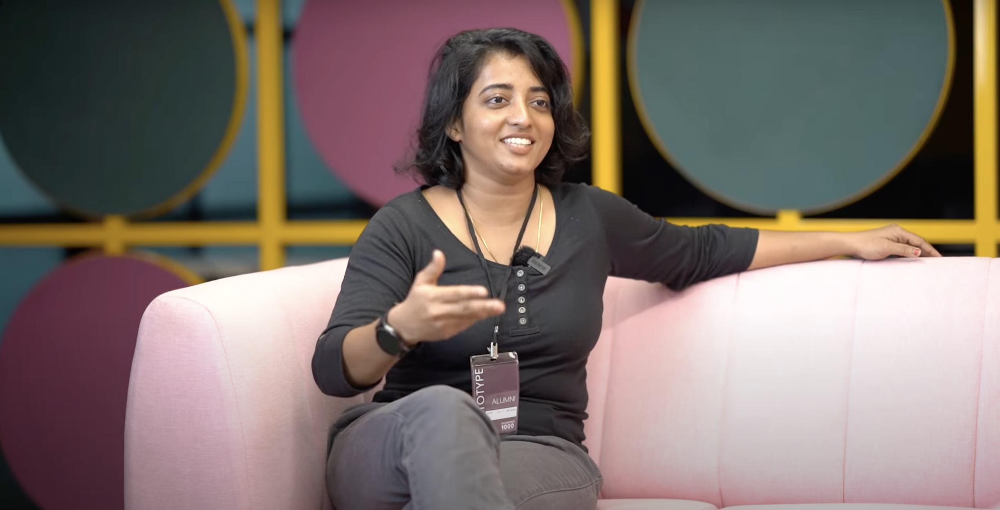
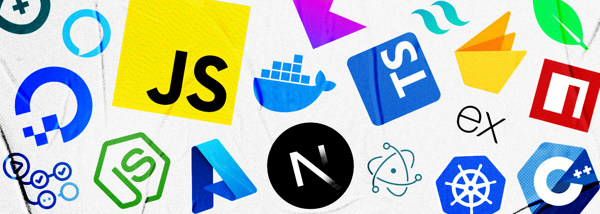

**Thanks for stopping by! 👋**

How many times have others visited?  
 

## About Me 🤓
- 🔭 **Currently:** Full Stack Python Developer at MrSolvo.com
- 💼 **Expertise:** Building scalable web applications with Django & React/Next.js
- 🌱 **Currently Learning:** Nginx for hosting websites & integrating AI features
- 💬 **Ask Me About:** Django, DRF, React/Next.js, and building full-stack applications
- 📫 **Reach Me At:** [tinypchristhudas@gmail.com](mailto:tinypchristhudas@gmail.com)
- ⚡ **Fun Fact:** I started coding while searching for life's meaning and found my passion instead

---

## ✍️ Quote That Drives Me
*"There is nothing more interesting than a problem you are unsure you can solve."*

---

## 🛠 Tech Stack

#### Backend

#### Frontend

#### Styling

#### Database & Cloud

---

## 💼 Projects

#### 🤝 **MrSolvo.com - Freelancing Platform** (Current)
- **Tech Stack:** Django REST Framework, Next.js, MySQL
- **Features:**
  - Full-stack development of a freelancing platform
  - Real-time chat and notification system
  - Secure payment integration
  - Context API for efficient state management
  - Responsive dashboard for users and providers

#### 🧠 **Online Therapy Platform**
- **Tech Stack:** Django REST Framework, React, PostgreSQL, Django Channels
- **Highlights:**
  - JWT-based authentication system
  - Real-time chat using Django Channels
  - Redux for state management
  - Secure booking and payment system
  - Video consultation features

#### 🛒 **E-Commerce Platform**
- **Tech Stack:** Django, HTML, JavaScript, PostgreSQL
- **Features:**
  - Custom user authentication
  - Product catalog with filtering
  - Shopping cart functionality
  - Order management system
  - Responsive design

---
## 📊 GitHub Stats

  
  

  

---

## 🌐 Connect With Me

  
  
  

